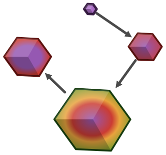
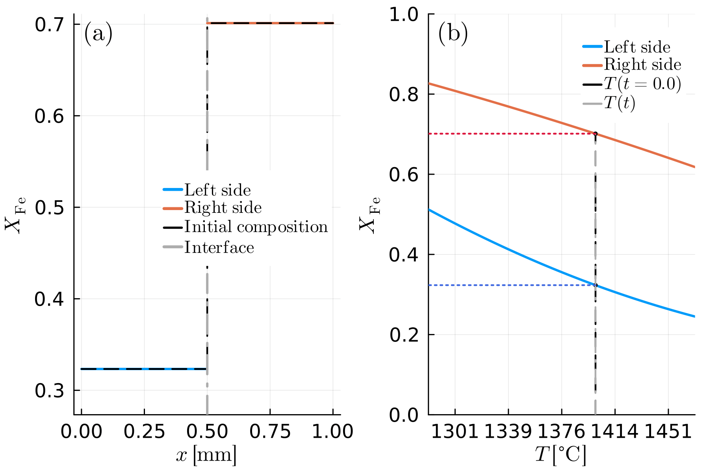

[](https://anstroh.github.io/MovingBoundaryMinerals.jl/stable/)
[](https://anstroh.github.io/MovingBoundaryMinerals.jl/dev/)
[](https://github.com/AnStroh/MovingBoundaryMinerals.jl/actions/workflows/CI.yml)
[](https://github.com/AnStroh/MovingBoundaryMinerals.jl/actions/workflows/SpellCheck.yml)
[](https://opensource.org/licenses/MIT)
[](https://doi.org/10.5281/zenodo.15535732)
[](https://github.com/SciML/ColPrac)

# MovingBoundaryMinerals.jl

[MovingBoundaryMinerals.jl](https://github.com/AnStroh/MovingBoundaryMinerals.jl) is a software package to model diffusion-controlled growth/resorption processes in mineral/mineral or mineral/matrix couples. We tested our software with various analytical and semi-analytical solutions (examples A1-A2, B1-B5, C1). In addition, we present some mineral growth/resorption examples (B6-B7, C2, D1, D2) showing compositional profiles, which can be observed in natural samples. For further details, we recommend reading [Stroh et al. (2025)](https://gmd.copernicus.org/articles/18/10203/2025/).

> [!NOTE]
> This package is still under active development. If you have any suggestions/ideas or found bugs, please feel free to reach out.
>  - The benchmarks and examples are working and provide the user with an insight into the capabilities of the package.

## Examples

`D1`/`D2`: thermodynamically constrained olivine crystal growth/resorption, animated over the full run (composition profile and phase-diagram trace evolving together) - `D1` cools linearly, `D2` follows an arbitrary, non-monotonic temperature-time path. See the [Example Gallery](https://anstroh.github.io/MovingBoundaryMinerals.jl/dev/man/example_gallery/) for the full write-up, including `D1`'s comparison to its published figure (these animations use a larger seed crystal than that figure, for a faster run).

<p>
  
  
</p>

## Documentation

The full documentation, including a [Getting Started](https://anstroh.github.io/MovingBoundaryMinerals.jl/dev/man/getting_started/) guide, is available for the [latest release](https://anstroh.github.io/MovingBoundaryMinerals.jl/stable/) and for the [development version](https://anstroh.github.io/MovingBoundaryMinerals.jl/dev/) on the `main` branch. See [CHANGELOG.md](CHANGELOG.md) for a summary of what changed between releases.

## Installation

`MovingBoundaryMinerals.jl` is a registered package and can be added as follows:


```julia
using Pkg; Pkg.add("MovingBoundaryMinerals")
```
or
```julia
julia> ]
pkg> add MovingBoundaryMinerals
```

However, since the package is under active development and not every feature leads to a new release, one can also do `add MovingBoundaryMinerals#main`, which will clone the main branch of the repository. After installation, you can test the package by running the following commands:

```julia
using MovingBoundaryMinerals
julia> ]
  pkg> test MovingBoundaryMinerals
```
The test can take a while.

## Graphical user interface (GUI)

Don't want to write or edit Julia code at all? The [`GUI/`](GUI/) folder has a local, browser-based interface covering single-crystal diffusion, moving-boundary diffusion couples, and thermodynamically constrained crystal growth/resorption — pre-filled forms, one click to run, and downloadable results (plots at 300 dpi plus the raw profile data). See [`GUI/README.md`](GUI/README.md) for a quick start, or the [GUI documentation page](https://anstroh.github.io/MovingBoundaryMinerals.jl/dev/man/gui/) for the full walkthrough.

## How to cite
Stroh, A., Aellig, P. S., and Moulas, E.: Numerical modelling of diffusion-limited mineral growth for geospeedometry applications, Geosci. Model Dev., 18, 10203–10220, https://doi.org/10.5194/gmd-18-10203-2025, 2025.

If you use the software itself, please also cite the specific version via its Zenodo archive: https://doi.org/10.5281/zenodo.15535732.

## Funding
The development of this package is supported by the DFG project 524829125 (VECTOR) and by the European Research Council through the MAGMA project, ERC Consolidator Grant \#771143.

## AI use
ChatGPT and Copilot were used in translating the original MATLAB© codes into Julia. Furthermore, Copilot was used in expanding the documentation of the functions. Moreover, we asked Claude to help with the documentation, finding/fixing bugs, increasing the readability of the documentation, and creating a GUI/logo. All the results were checked and are approved by the authors.