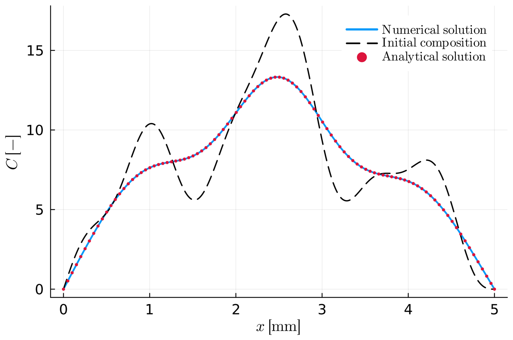
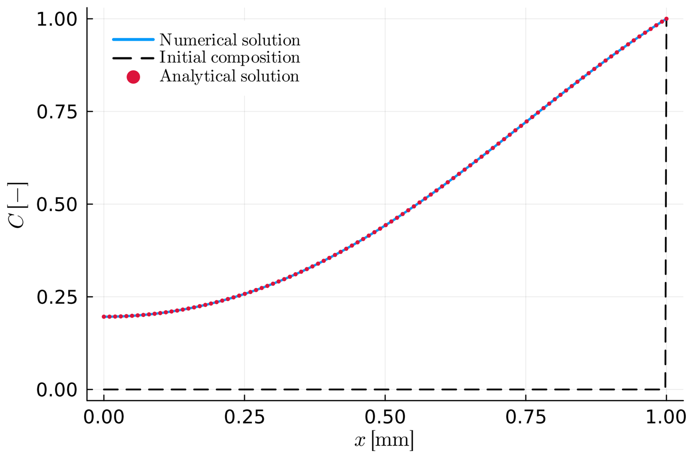
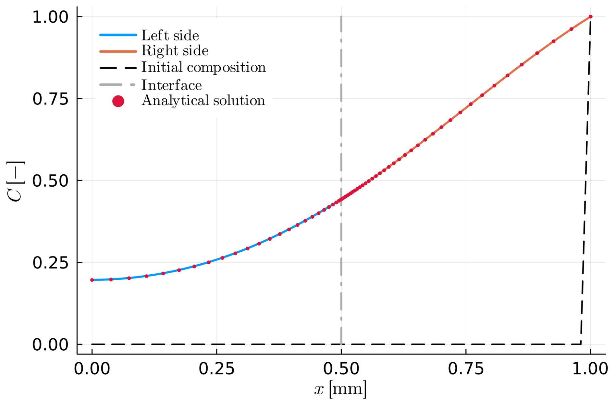
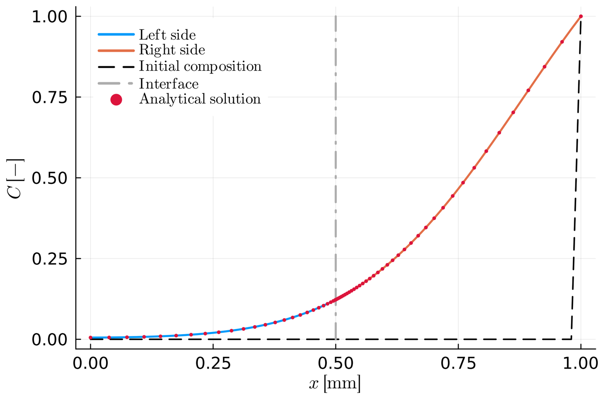
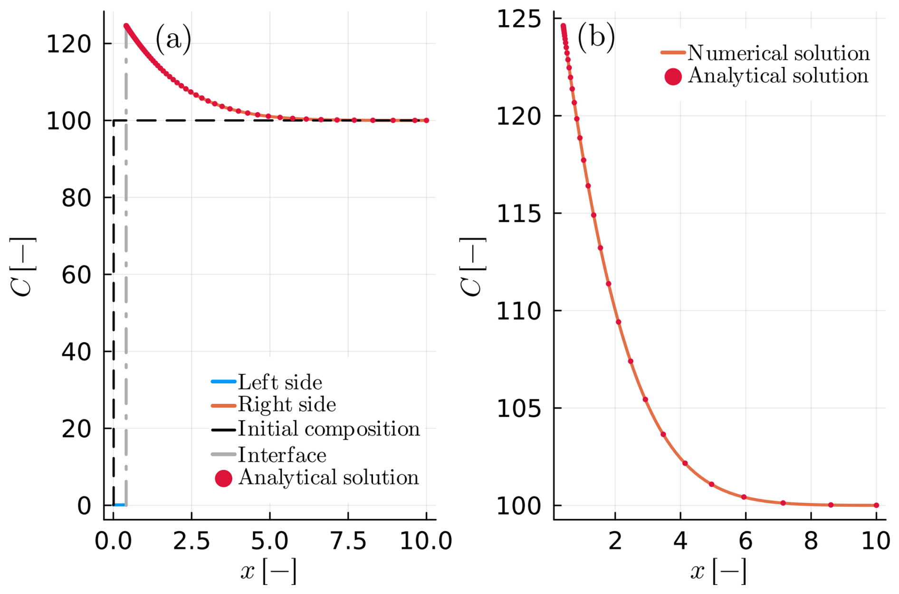
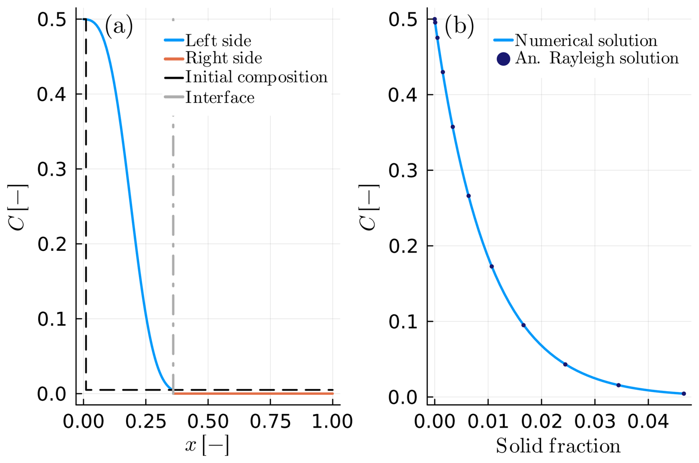

```@meta
CurrentModule = MovingBoundaryMinerals
```
# [Benchmarks](@id benchmarks)

The examples on this page are each tested against a closed-form analytical or semi-analytical solution (see [`MovingBoundaryMinerals.Benchmarks`](@ref "List of all functions") and `test/`) — this is what distinguishes a *benchmark* from the other worked examples in the package: every curve below has an independently-derived solution plotted alongside the numerical one. For examples that instead show realistic or illustrative output with no closed-form solution to compare against, see [Example Gallery](@ref example-gallery).

All figures below are reproduced from [Stroh2025](@cite) (© Author(s) 2025, distributed under the Creative Commons Attribution 4.0 License) by its authors; see [List of examples](@ref) for how every example maps to a paper figure, and the caption of each figure below for which script reproduces it.

## A1 — Intracrystalline diffusion within a planar crystal

Diffusion of a sinusoidal initial profile into a planar crystal, against the classical harmonic-function analytical solution ([`sinusoid_profile`](@ref)).


*Figure 2 of [Stroh2025](@cite), reproduced by [`A1.jl`](https://github.com/AnStroh/MovingBoundaryMinerals.jl/blob/main/examples/A1.jl).*

## A2 — Intracrystalline diffusion in a spherical crystal

The same idea in spherical geometry (``n = 3``): zero initial composition, unit boundary composition.


*Figure 3 of [Stroh2025](@cite), reproduced by [`A2.jl`](https://github.com/AnStroh/MovingBoundaryMinerals.jl/blob/main/examples/A2.jl).*

## B1 — Intercrystalline diffusion within a spherical diffusion couple

A moving-interface diffusion couple with identical material properties on both sides and ``K_D = 1.0``, against the semi-analytical solution for that special case.


*Figure 4 of [Stroh2025](@cite), reproduced by [`B1.jl`](https://github.com/AnStroh/MovingBoundaryMinerals.jl/blob/main/examples/B1.jl).*

## B2 — Diffusion couple with time-evolving diffusivity

The same setup as B1, but with a diffusivity that evolves through a cooling history, validating the time-transformation technique this uses internally.


*Figure 5 of [Stroh2025](@cite), reproduced by [`B2.jl`](https://github.com/AnStroh/MovingBoundaryMinerals.jl/blob/main/examples/B2.jl).*

## B4 — Spherical crystal growth via Rayleigh fractionation

Growth of a spherical crystal in the ``D^A \ll D^B`` limit, against the Rayleigh-fractionation analytical solution — both the composition profile and the interface position vs. solid fraction.


*Figure 6 of [Stroh2025](@cite), reproduced by [`B4.jl`](https://github.com/AnStroh/MovingBoundaryMinerals.jl/blob/main/examples/B4.jl).*

## B5 — Planar growth from a melt

Planar crystal growth from a melt reservoir, with a zoomed-in view of the melt-side profile compared against the analytical solution.


*Figure 7 of [Stroh2025](@cite), reproduced by [`B5.jl`](https://github.com/AnStroh/MovingBoundaryMinerals.jl/blob/main/examples/B5.jl).*

## C1 — Rayleigh fractionation via the total mass-balance condition

The same physical setup as B4 — including the Rayleigh-fractionation analytical solution — solved with the total mass-balance interface condition ([`set_inner_bc_mb!`](@ref)) instead of the flux-balance one, to confirm the two formulations agree.


*Figure C1 of [Stroh2025](@cite), reproduced by [`C1.jl`](https://github.com/AnStroh/MovingBoundaryMinerals.jl/blob/main/examples/C1.jl).*

!!! note "B3"
    B3 (Lasaga formulation) isn't part of the paper and has no corresponding figure here yet — see [List of examples](@ref).
