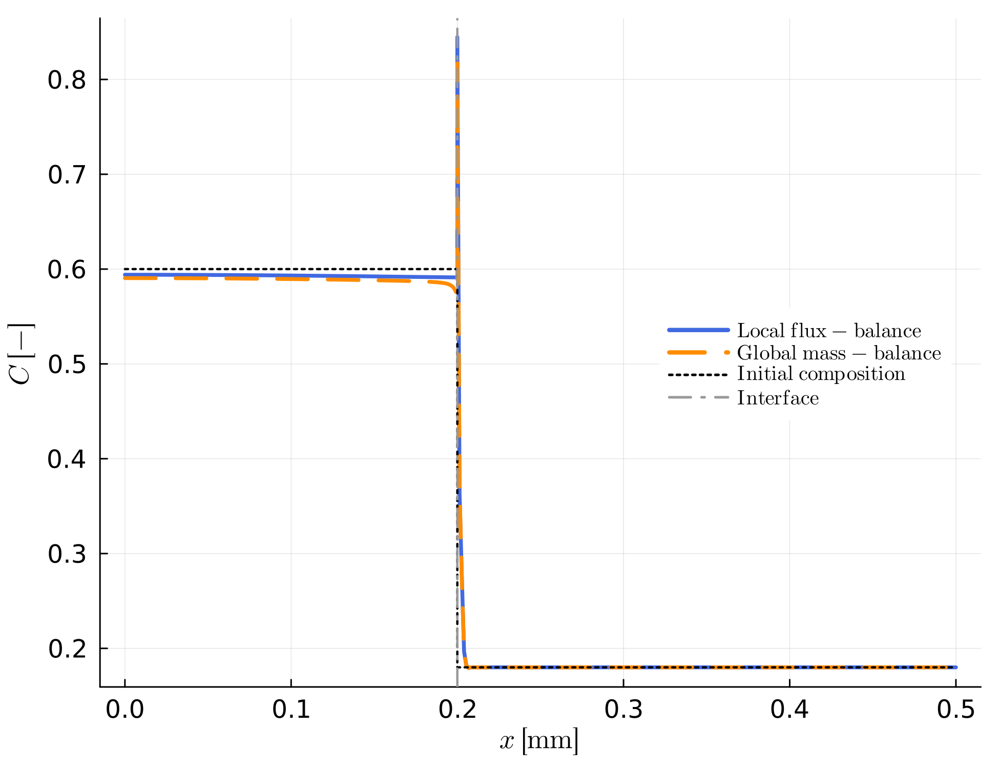

```@meta
CurrentModule = MovingBoundaryMinerals
```
# [Boundary Conditions](@id boundary-conditions)

Two independent sets of boundary conditions close the diffusion problem described in [Numerical Approach](@ref numerical-approach): **outer** boundary conditions at the two edges of the modelling domain, and **inner** (interface) boundary conditions at the moving interface. This page covers the equations behind both; see [Quick Reference](@ref quick-reference) for which input parameter or function controls each, and [General Remarks](@ref) for how inner/outer boundaries relate to each other conceptually.

## Outer boundary conditions

Set independently per side via `BCout = [left, right]` in [`set_outer_bc!`](@ref):

- **Dirichlet** (`BCout[i] == 1`) — composition is fixed at the domain edge:

  ```math
  C(x_{edge}) = C_{edge}
  ```

  taken from the first/last entry of `C_left`/`C_right`. Use this to represent an effectively infinite reservoir (e.g. a melt far from the crystal) that the diffusion front never depletes.

- **Neumann** (`BCout[i] != 1`) — zero flux:

  ```math
  D \left.\frac{\partial C}{\partial x}\right|_{x_{edge}} = 0
  ```

  This is implemented implicitly: the corresponding row of the FEM system ([Numerical Approach](@ref numerical-approach)) is simply left as assembled, since a Galerkin discretization already enforces zero flux as its natural boundary condition unless a constraint overrides it. Use this for e.g., closed systems, where [`calc_mass_err`](@ref) is expected to stay small — see [Interpreting Output](@ref interpreting-output).

## Inner (interface) boundary conditions

The interface is not fixed in space — it moves at the modelled growth/resorption rate — so two conditions are needed to close the system at the two grid nodes adjacent to it (the last left node and the first right node). Three physically distinct approaches are available, one per function you call: the **local flux-balance** condition, the **local mass-balance** condition, and the **(thermodynamically constrained) Stefan condition**. Each is self-contained — described fully in its own subsection below, without reusing another's equations or terminology — and only one is active in any given model run. A [summary table](@ref boundary-conditions-summary) at the end contrasts all three.

### Local flux-balance condition — [`set_inner_bc_flux!`](@ref)

Used for prescribed-rate growth/resorption in diffusion couples ("B" examples). `V_ip` is a fixed model input here. Given `V_ip`, two conditions solve for the two unknown interface compositions:

1. **Partitioning** — the interface compositions are related by the (fixed) distribution coefficient:

   ```math
   K_D = \frac{C_{left}^{int}}{C_{right}^{int}}
   ```

2. **Flux continuity** — because the interface compositions on the two sides differ (``C_{left}^{int} \neq C_{right}^{int}`` in general), moving the interface at the prescribed velocity `V_ip` by itself converts mass from one phase into the other. This is balanced against the mismatch in diffusive flux on either side of the interface:

   ```math
   \left(\rho_{right} C_{right}^{int} - \rho_{left} C_{left}^{int}\right) V_{ip} = \rho_{left} D_{left}\left.\frac{\partial C}{\partial x}\right|^{int}_{left} - \rho_{right} D_{right}\left.\frac{\partial C}{\partial x}\right|^{int}_{right}
   ```


### Local mass-balance condition — [`set_inner_bc_mb!`](@ref)

Used where the total amount of a species in the domain is prescribed rather than matched locally at the interface ("C" examples). `V_ip` is a fixed model input here, exactly as in the flux-balance condition above. Two conditions are applied:

1. **Global mass balance** — the volume-weighted sum of the whole composition vector must equal a prescribed total mass:

   ```math
   \sum_i \Delta V_i\, C_i = M_{tot}
   ```

   via `dVolC`/`Mtot` ([`calc_volume`](@ref), [`calc_mass_vol`](@ref)).

2. **Partitioning** — the interface compositions are related by the (fixed) distribution coefficient:

   ```math
   K_D = \frac{C_{left}^{int}}{C_{right}^{int}}
   ```

### Thermodynamically constrained (Stefan) condition — [`set_inner_bc_stefan!`](@ref)

Used when the interface composition comes from a digitized phase diagram rather than a fixed `K_D` ("D" examples). Both interface nodes get Dirichlet values read directly from the phase-diagram polynomials at the current temperature:

```math
C_{left}^{int} = C_{left}(T), \qquad C_{right}^{int} = C_{right}(T)
```

`V_ip` is not a model input for this condition — see [The (chemical) Stefan Problem](@ref stefan-problem) for how it is computed, how `C_left(T)`/`C_right(T)` are obtained from the digitized phase diagram ([`composition`](@ref)), and how the initial bulk composition and domain length are set.


## [Comparing the three inner conditions](@id boundary-conditions-summary)

| | Local flux-balance | Global mass-balance | Stefan condition |
|:--|:--|:--|:--|
| Interface compositions | solved from `K_D` + flux continuity | solved from `K_D` + global mass constraint | read from the phase diagram (Dirichlet) |
| Interface velocity `V_ip` | prescribed model input | prescribed model input | solved for — see [The (chemical) Stefan Problem](@ref stefan-problem) |
| Example family | "B" | "C" | "D" |

The Stefan condition needs fundamentally different inputs (a phase diagram and a temperature path, not a fixed `K_D`), so it isn't directly comparable on the same setup — but the flux-balance and mass-balance conditions are: running the *exact same* stationary diffusion couple (same `D`, `Ri`, `K_D(t)` path, `V_ip = 0`) with each shows they agree in the far field (both conserve the same total mass) and have some small disagreement near the interface, since one enforces flux continuity there and the other only the domain-wide integral:


