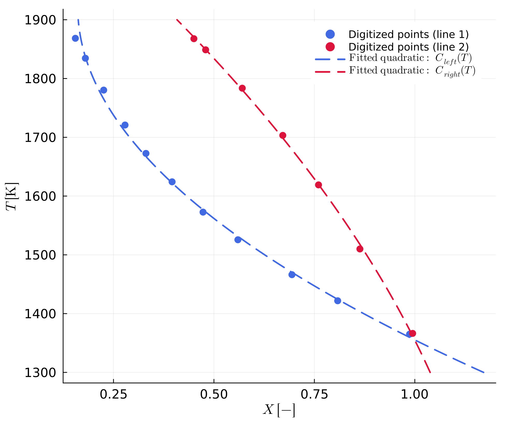

```@meta
CurrentModule = MovingBoundaryMinerals
```
# [Digitizing the phase diagram and extracting coefficients](@id digitization)

## Phase diagrams

The chemical Stefan problem needs the equilibrium composition of each phase at the interface as a function of temperature (see [The Stefan Problem](@ref stefan-problem)) — this is exactly what a phase diagram encodes for how these compositions enter the interface condition. At any given temperature, two reaction lines bound the two-phase field: one gives the composition of the left phase, the other the composition of the right phase, each fit as a quadratic function of temperature (Eq. 1). The user supplies the resulting coefficients `a`, `b`, `c` for both lines as input before the model starts.

## Work flow

We used the `PlotDigitizer.jl` package in Julia [StrohFrasunkiewicz2025](@cite) ([https://github.com/AnStroh/PlotDigitizer.jl](https://github.com/AnStroh/PlotDigitizer.jl), version v0.1.0) to digitize the phase diagram; a shortened copy ships in `additional_codes/digitizePlot.jl`. It lets you click points along the two reaction lines and export their X-T coordinates, which are then fit to obtain the coefficients below. Here is a short guideline.

!!! warning "Extra dependency required"
    `digitizePlot.jl` uses `GLMakie` for the interactive image viewer. `GLMakie` is **not** a dependency of `MovingBoundaryMinerals.jl` itself (it is heavy and only needed for this optional, interactive digitizing step), so you need to install it yourself first: `using Pkg; Pkg.add("GLMakie")`. `FileIO` and `DelimitedFiles`, the other two packages `digitizePlot.jl` uses, are already part of `MovingBoundaryMinerals.jl`'s dependencies.

1. Define the path to the image of the phase diagram (`.png` or `.jpg` file) as a variable. It is important that the image only shows the phase diagram (like `examples/Examples_phase_diagram/Ol_Phase_diagram_without_framework.png`) and has no border. The phase diagram should show the composition on the x-axis and the temperature on the y-axis.
2. Define the limits of the axes in `X_BC` and `Y_BC`. **`Y_BC` (temperature) must be in K, even though the source phase-diagram image itself is very likely to have its axis printed in °C** (the usual convention for this kind of figure) - `digitizePlot` only ever sees pixel coordinates from the image and has no idea what unit its axis is labelled in, so it takes whatever numbers you give it in `Y_BC` at face value. Convert the image's printed axis limits to K yourself before typing them in (e.g. `examples/Examples_phase_diagram/Ol_Phase_diagram_without_framework.png` spans 1000-1600°C, so its `T_BC` in `additional_codes/digitizePlot.jl` is `(1273.0, 1873.0)`, not `(1000.0, 1600.0)`). Typing the printed °C limits directly in would silently digitize and fit everything in the wrong unit, one that happens to look reasonable (a few hundred to a couple thousand) right up until [`composition`](@ref) is called downstream with a genuine Kelvin temperature.
3. Run `digitizePlot(X_BC, Y_BC, file_name)` to set or delete points on the two reaction lines, switch between lines, and export the digitized X-T coordinates to CSV.
4. Use `CalculateReactionLine.jl` (also in `additional_codes`) to fit the digitized points via least squares to

```math
X(T) = a + b T + c T^2 \qquad (1)
```

where `X` is the composition at the phase transition, `T` is the temperature in K, and `a`, `b`, `c` are the coefficients of the quadratic equation (in that order — `a` is the constant term, `c` the `T²` coefficient). The fitted coefficients are written to a CSV file (see `examples/Examples_phase_diagram/Coefficients_Reaction_lines.csv` for the file used e.g. by example [D1](https://github.com/AnStroh/MovingBoundaryMinerals.jl/blob/main/examples/D1.jl)) and can be loaded with [`coeff_trans_line`](@ref) and evaluated at any temperature with [`composition`](@ref).

Here is that exact file: the two reaction lines digitized from D1's phase diagram (`digitized_data_1.csv`/`digitized_data_2.csv`), each with its fitted quadratic evaluated with [`composition`](@ref) over the digitized temperature range.



!!! tip "Fewer points can be more accurate"
    CSV files with fewer, carefully placed points tend to give a more accurate quadratic fit near the ends of the composition range (X close to 0 or 1) than files with many densely digitized points. Always check the fit against the original phase diagram near its boundaries.

This step can be skipped entirely if the coefficients `a`, `b`, `c` are already known: in that case they can be entered directly, e.g. via `eq_values` in the example scripts.
