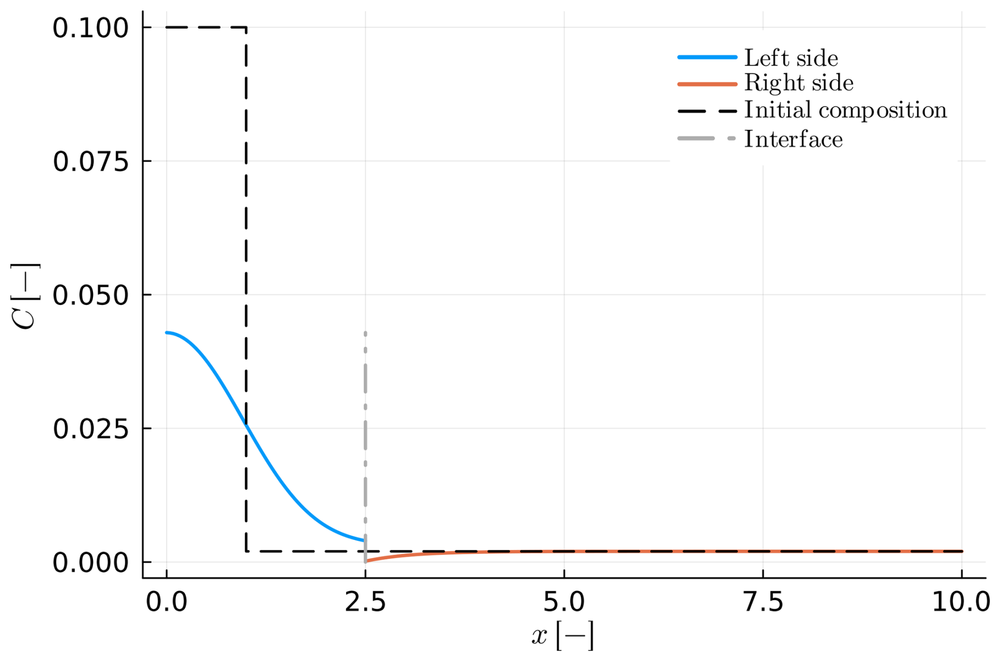
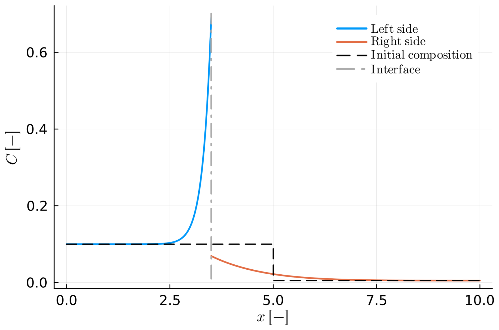
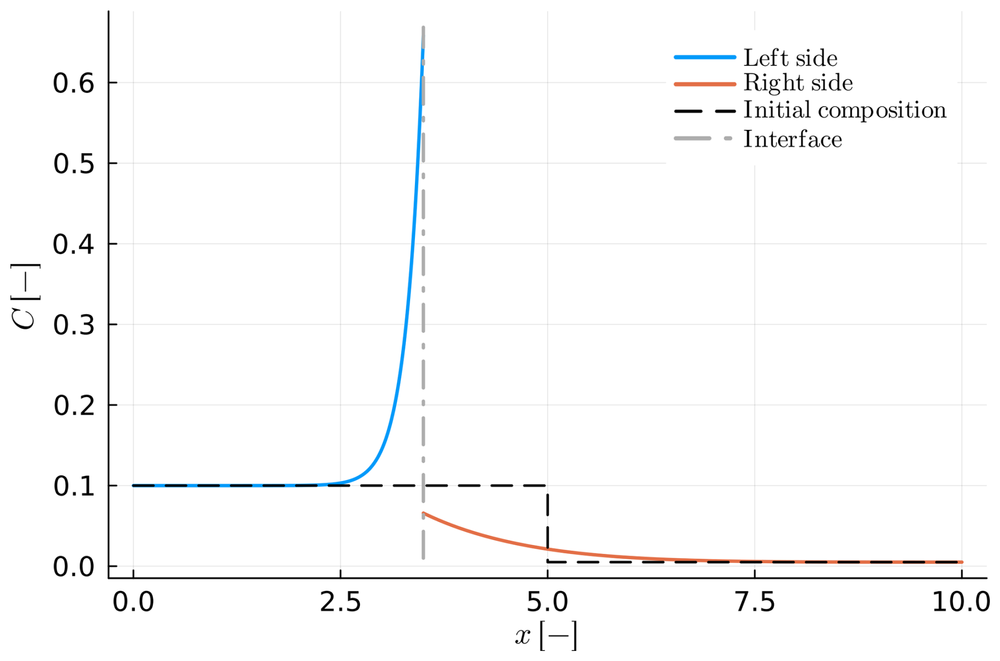
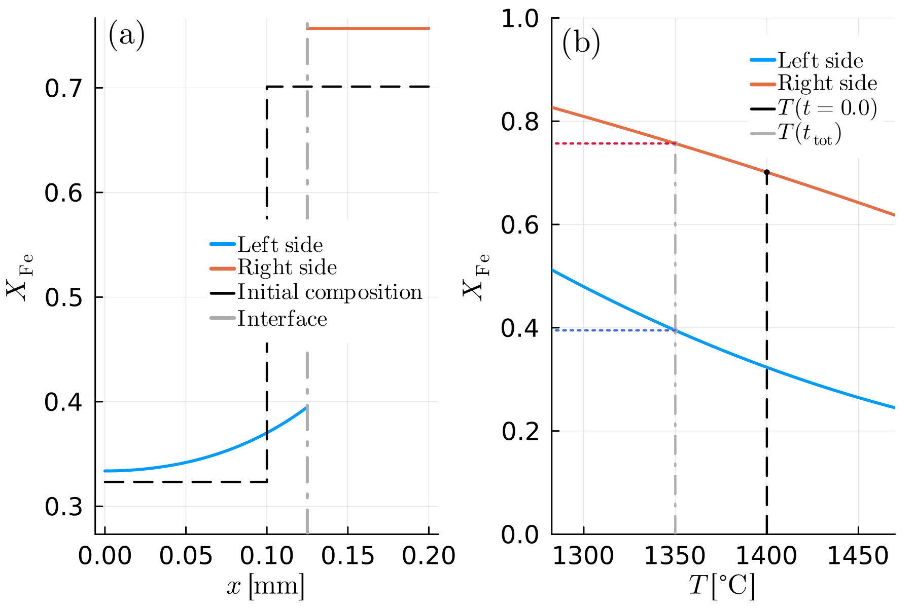
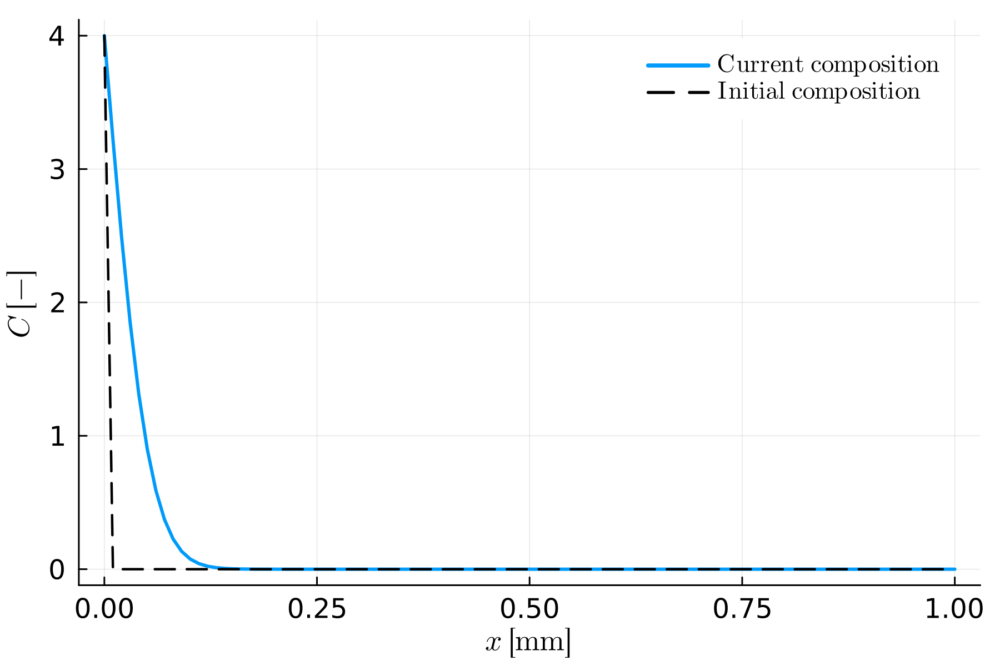
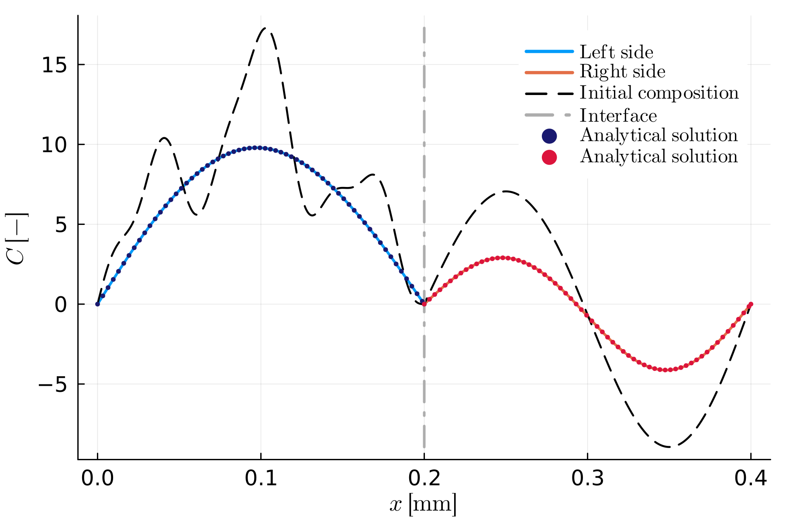
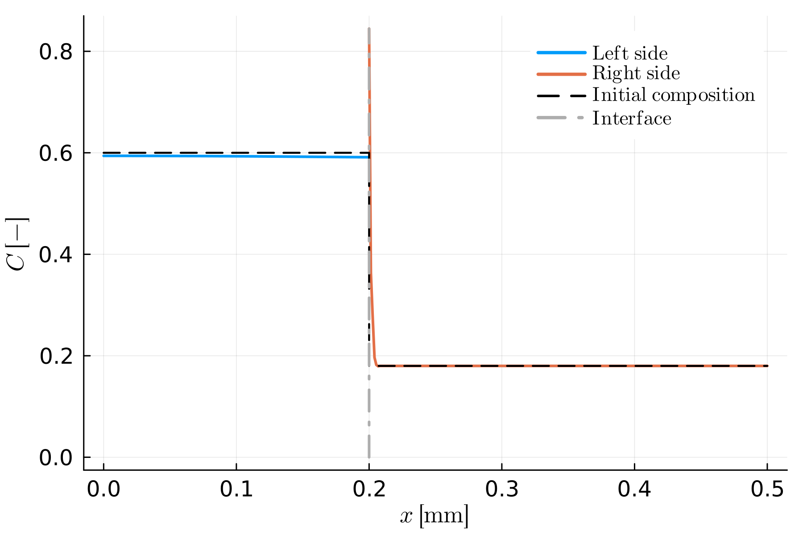
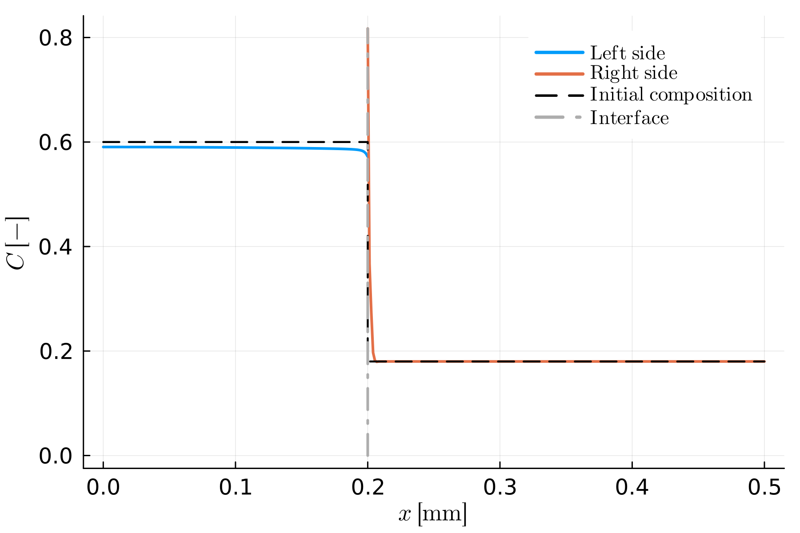
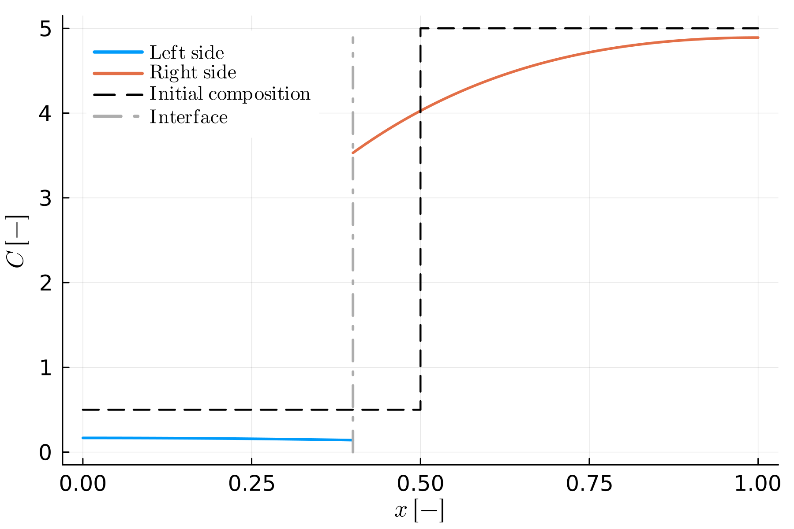
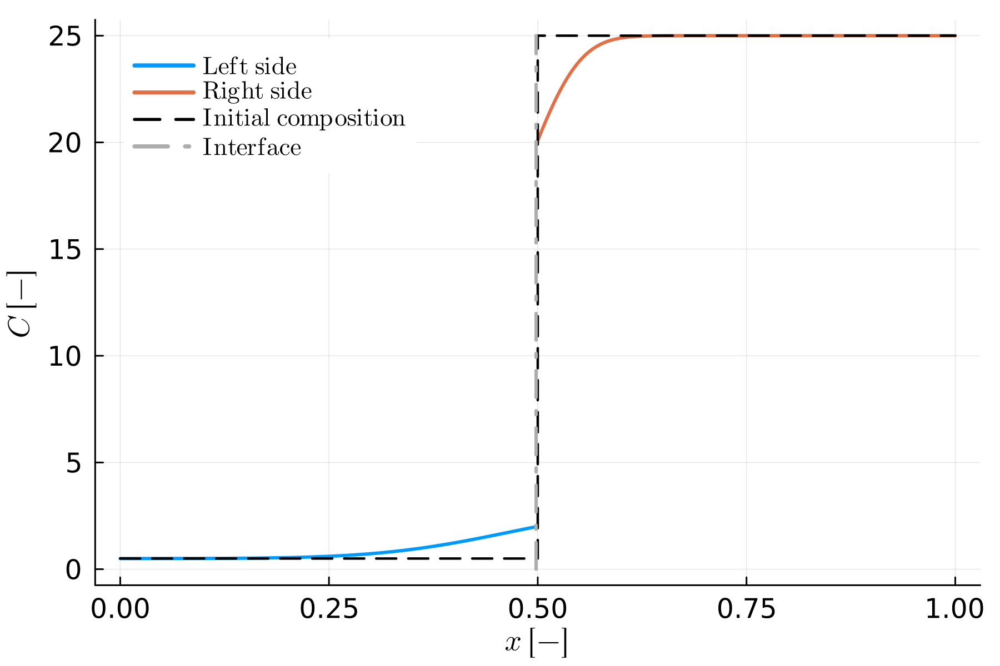

```@meta
CurrentModule = MovingBoundaryMinerals
```
# [Example Gallery](@id example-gallery)

The examples on this page have no closed-form solution to compare against — they show the kind of realistic or illustrative output the package produces rather than a validation. For examples tested against an analytical or semi-analytical solution instead, see [Benchmarks](@ref benchmarks).

## From the paper

All figures in this section are reproduced from [Stroh2025](@cite) (© Author(s) 2025, distributed under the Creative Commons Attribution 4.0 License) by its authors; see [List of examples](@ref) for how every example maps to a paper figure, and the caption of each figure below for which script reproduces it.

### B6 — Spherical crystal growth with a decreasing ``K_D``

Chemical zoning produced by simultaneous growth and diffusion as the distribution coefficient decreases over the run (``V_{ip} > 0``).


*Figure 8 of [Stroh2025](@cite), reproduced by [`B6.jl`](https://github.com/AnStroh/MovingBoundaryMinerals.jl/blob/main/examples/B6.jl).*

### B7 — Spherical crystal resorption

The resorption case (``V_{ip} < 0``): pronounced compositional gradients at the consuming interface.


*Figure 9 of [Stroh2025](@cite), reproduced by [`B7.jl`](https://github.com/AnStroh/MovingBoundaryMinerals.jl/blob/main/examples/B7.jl).*

### C2 — Resorption via the total mass-balance condition

The same idea as B7, solved with the total mass-balance interface condition ([`set_inner_bc_mb!`](@ref)) instead of the flux-balance one.


*Figure C2 of [Stroh2025](@cite), reproduced by [`C2.jl`](https://github.com/AnStroh/MovingBoundaryMinerals.jl/blob/main/examples/C2.jl).*

### D1 — Diffusion-limited olivine crystallization

The thermodynamically constrained (Stefan) family applied to a realistic geologic case: olivine crystallizing on cooling, with the modelled composition profile and the equilibrium interface compositions traced on the phase-diagram section (see [The (chemical) Stefan Problem](@ref stefan-problem)).


*Figure 10 of [Stroh2025](@cite), reproduced by [`D1.jl`](https://github.com/AnStroh/MovingBoundaryMinerals.jl/blob/main/examples/D1.jl).*

!!! note "D2"
    D2 (non-monotonic temperature path) isn't part of the paper — see [below](@ref example-gallery-templates) for its own figure instead.

## [Templates and tutorial examples](@id example-gallery-templates)

The figures in this section aren't from the paper — they're generated directly from running the corresponding example script, showing the same `main_codes/` templates the [General Remarks](@ref) page describes, in increasing order of complexity (see [Getting Started](@ref getting-started) for a full walkthrough starting from `Simple_Diff`).

### `Simple_Diff` — Single-crystal diffusion

Diffusion of a fixed-composition boundary source into a homogeneous, semi-infinite planar crystal — no moving boundary, no second phase, the simplest problem the package can solve.


*Generated by [`Simple_Diff.jl`](https://github.com/AnStroh/MovingBoundaryMinerals.jl/blob/main/examples/Simple_Diff.jl).*

### `Diff_couple_no_interaction` — Two independent single crystals

Two single crystals with sinusoidal initial profiles, diffusing side by side with no interface reaction between them — each side is independently benchmarked against its own analytical solution.


*Generated by [`Diff_couple_no_interaction.jl`](https://github.com/AnStroh/MovingBoundaryMinerals.jl/blob/main/examples/Diff_couple_no_interaction.jl).*

### `Diff_couple_Flux` — Diffusion couple, flux-balance condition

A true diffusion couple with a stationary interface (no prescribed growth), solved with the flux-balance interface condition ([`set_inner_bc_flux!`](@ref)).


*Generated by [`Diff_couple_Flux.jl`](https://github.com/AnStroh/MovingBoundaryMinerals.jl/blob/main/examples/Diff_couple_Flux.jl).*

### `Diff_couple_MB` — Diffusion couple, total mass-balance condition

The same stationary-interface diffusion couple, solved with the total mass-balance interface condition ([`set_inner_bc_mb!`](@ref)) instead.


*Generated by [`Diff_couple_MB.jl`](https://github.com/AnStroh/MovingBoundaryMinerals.jl/blob/main/examples/Diff_couple_MB.jl).*

### `Diff_couple_Flux_growth` — Diffusion couple with growth, flux-balance condition

The flux-balance diffusion couple with the interface additionally prescribed to move (``V_{ip} \neq 0``) — the interface has visibly shifted from its initial position by the end of the run.


*Generated by [`Diff_couple_Flux_growth.jl`](https://github.com/AnStroh/MovingBoundaryMinerals.jl/blob/main/examples/Diff_couple_Flux_growth.jl).*

### `Diff_couple_MB_growth` — Diffusion couple with growth, total mass-balance condition

The same idea, solved with the total mass-balance interface condition instead.


*Generated by [`Diff_couple_MB_growth.jl`](https://github.com/AnStroh/MovingBoundaryMinerals.jl/blob/main/examples/Diff_couple_MB_growth.jl).*
