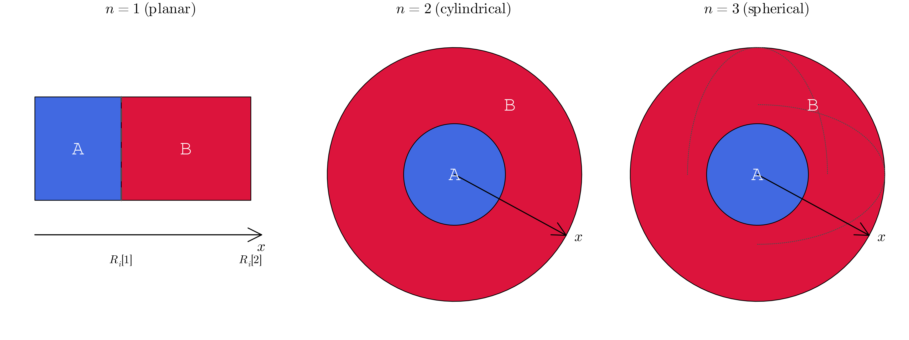
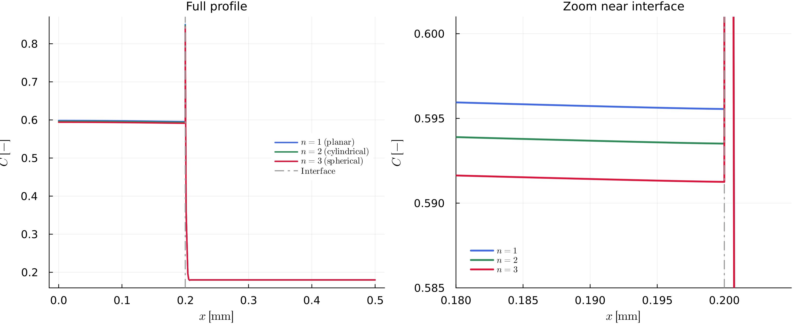

```@meta
CurrentModule = MovingBoundaryMinerals
```
# [Numerical Approach](@id numerical-approach)

The moving interface is tracked explicitly rather than fixed in space. This page covers the governing equation and the discretization; for the equations that close the system at the domain edges and at the interface, see [Boundary Conditions](@ref boundary-conditions).

## Governing equation

Each phase satisfies a diffusion equation, generalized to planar, cylindrical, or spherical geometry through the geometry exponent `n`:

```math
\frac{\partial C}{\partial t} = \frac{1}{x^{n-1}}\frac{\partial}{\partial x}\left(x^{n-1} D \frac{\partial C}{\partial x}\right), \qquad n \in \{1, 2, 3\}
```

with `n = 1` planar, `n = 2` cylindrical, and `n = 3` spherical (see `n` in [Quick Reference](@ref quick-reference)). `D` is the diffusion coefficient of that phase — constant, or evaluated from an Arrhenius law (see below). The left and right phases each solve this equation on their own grid, with their own `D`, coupled only through the interface conditions ([Boundary Conditions](@ref boundary-conditions)).

`x` is always the radial/planar coordinate measured from the domain's inner edge (the symmetry axis for `n = 2`, the center point for `n = 3`), with phase *A* occupying `[0, R_i[1]]` and phase *B* occupying `[R_i[1], R_i[2]]`:



The geometry exponent's effect is real but modest for a diffusion couple that's mostly equilibrated — running the exact same diffusion-couple setup (same `D`, `Ri`, `K_D(t)` path) with each value of `n` gives interface compositions that shift monotonically by well under 1% (in the case of this parameter set) between `n = 1` and `n = 3`, invisible on the full profile but clearly separated once zoomed in near the interface:



## Diffusion coefficient

Setting `Di = [-1.0, -1.0]` computes `D` per phase from the Arrhenius relationship instead of using a constant value (see [Quick Reference](@ref quick-reference)):

```math
D = D_0 \exp\left(-\frac{E_a}{R T}\right)
```

with pre-exponential factor `D0`, activation energy `Ea`, universal gas constant `R`, and temperature `T` in K ([`update_t_dependent_param!`](@ref), [`update_t_dependent_param_simple!`](@ref)). Since `T` can itself vary over the run (see [General Remarks](@ref)), `D` is re-evaluated at every time step in that case.

## Spatial discretization: Galerkin FEM

The equation is discretized with a Galerkin finite-element scheme using linear ("hat") shape functions on each element ([`fill_matrix!`](@ref)). This produces, per element, a local mass matrix and a local stiffness matrix such that

```math
M \dot{C} + K C = 0,
```

assembled into global matrices for each phase and merged block-diagonally into one system covering both phases ([`construct_matrix_fem`](@ref), [`blkdiag`](@ref)).

## Time discretization: implicit Euler

Time stepping is implicit (backward Euler), so every step solves

```math
\left(\frac{M}{\Delta t} + K\right) C^{t+\Delta t} = \frac{M}{\Delta t} C^{t}
```

for the new composition ([`solve_soe`](@ref)). This is unconditionally stable; `dt` is still limited adaptively via a CFL-type criterion ([`calculate_dt`](@ref), [`find_dt`](@ref)), but for accuracy of the interface tracking and regridding rather than for numerical stability.

## Putting it together

At every time step:

1. **Interface condition** — applied via [`set_inner_bc_flux!`](@ref), [`set_inner_bc_mb!`](@ref), or [`set_inner_bc_stefan!`](@ref), depending on the problem family (see [Boundary Conditions](@ref boundary-conditions)).
2. **Advection and regridding** — the interface is advected with the resulting velocity and the grid on both sides is rebuilt around its new position ([`advect_interface_regrid!`](@ref), [`regrid!`](@ref)); see [Mesh Refinement](@ref mesh-refinement) for how.
3. **Diffusion solve** — the governing equation above is solved implicitly in both phases with the FEM scheme described here ([`construct_matrix_fem`](@ref), [`solve_soe`](@ref)).

For the full derivation and benchmarks, see [Stroh2025](@cite).
