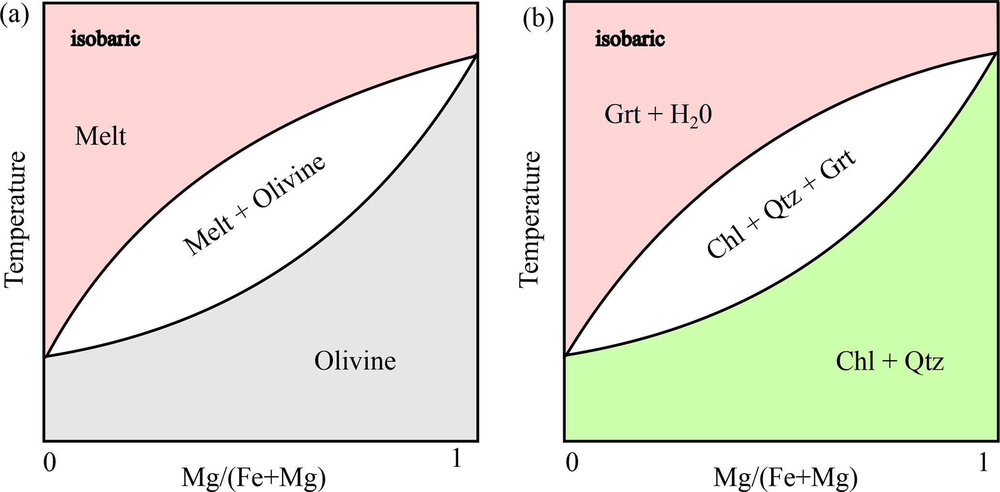

```@meta
CurrentModule = MovingBoundaryMinerals
```
# [The (chemical) Stefan problem](@id stefan-problem)

The Stefan problem describes the movement of a reaction front in a thermodynamically constrained system — the propagation of an ice front, or the crystallization/resorption of minerals, are classic examples [Rubinstein1971](@cite). `MovingBoundaryMinerals.jl` solves this directly for mineral growth and resorption, using a digitized phase diagram to constrain the interface composition rather than a fixed partition coefficient. This page covers the physics and the input parameters specific to that mode; for the full derivation and benchmarks, see [Stroh2025](@cite).

## Input parameters

This section covers the input parameters that need more explanation than their names alone provide. Required inputs are: the initial interface position `Ri[1]` (which also sets the size of the left phase in the composition profile); the composition of interest `CompInt`, which fixes the starting bulk composition and, from it, the total domain length `Ri[2]` (see below); the start and end temperature of the growth process (`Tstart`, `Tstop`); and the temperature bounds of the digitized phase-diagram section (`TMIN`, `TMAX`), which must satisfy `Tstart, Tstop` ``\in`` `[TMIN, TMAX]` — don't confuse the two pairs. All temperatures are given in K. The phase-transformation-line coefficients go in `eq_values`.

## Determining the interface composition

Digitizing two adjacent reaction lines of the phase diagram reduces it to the binary, two-phase system our code solves for (see [Digitization](@ref digitization)). This works for both magmatic (a) and metamorphic (b) systems — any pair of reaction lines bounding a two-phase field, e.g. melt + olivine or the garnet-forming dehydration reaction chlorite + quartz ``\rightleftharpoons`` garnet + H``_2``O shown below, reduces to the same binary setup:


*Figure 1 of [Stroh2025](@cite) (© Author(s) 2025, distributed under the Creative Commons Attribution 4.0 License).*

Each line is fit as a quadratic function of temperature:

```math
X(T) = a + b T + c T^2 \qquad (1)
```

We use these polynomials ([`composition`](@ref)) to determine the equilibrium compositions of the two phases at the starting temperature `Tstart`, ``C_{left}(T_{start})`` and ``C_{right}(T_{start})``. The initial composition profile is a step function — two homogeneous regions, one per phase — with each region's composition read directly from these values.

`CompInt` sets where that step sits, via the lever rule: it is the volume fraction of the left phase in the bulk system, giving a bulk composition

```math
X_c = (1 - \mathrm{CompInt})\, C_{right}(T_{start}) + \mathrm{CompInt}\, C_{left}(T_{start})
```

This same lever-rule balance fixes the total domain length, given the initial interface position `Ri[1]`: for planar geometry (`n = 1`), mass balance between the two homogeneous regions gives

```math
L = R_i[1] \, \frac{C_{right}(T_{start}) - C_{left}(T_{start})}{C_{right}(T_{start}) - X_c}
```

used directly as `Ri[2]` — i.e. for the Stefan-problem examples, the domain length is *derived* from `CompInt` and the phase diagram rather than being a free input like it is for the flux-balance/total mass-balance families.

!!! warning "Currently planar (n = 1) only"
    The examples ([`D1`](https://github.com/AnStroh/MovingBoundaryMinerals.jl/blob/main/examples/D1.jl), [`D2`](https://github.com/AnStroh/MovingBoundaryMinerals.jl/blob/main/examples/D2.jl)) and the `Chemical_Stefan_problem_XT.jl` template all set `n = 1`, and the domain-length equation above is only verified for that case. The general-geometry form used in the code does not reduce algebraically to this for `n = 2`/`3` — treat cylindrical/spherical Stefan-problem setups as unverified until that's revisited.

## Numerical approach

Equilibrium compositions at the interface are evaluated from the phase diagram (or a fixed partition coefficient `K_D`) at the current temperature and applied as a Dirichlet condition ([`set_inner_bc_stefan!`](@ref)). Unlike the other two interface conditions (see [Boundary Conditions](@ref boundary-conditions)), the interface velocity `V_ip` is not a model input here — it is solved for at every step, so the growth/resorption rate emerges from the solution rather than being prescribed.

With the diffusive fluxes on either side of the interface,

```math
J_{left} = -\rho_{left} D_{left} \left.\frac{\partial C}{\partial x}\right|^{int}_{left}, \qquad
J_{right} = -\rho_{right} D_{right} \left.\frac{\partial C}{\partial x}\right|^{int}_{right}
```

evaluated with a first-order finite difference against the interior grid nodes adjacent to the interface, the interface velocity is

```math
V_{ip} = \frac{J_{right} - J_{left}}{C_{right}^{int} - C_{left}^{int}}
```

recomputed every time step from the current phase-diagram compositions and diffusivities. ``\left(V_{ip}\left(C_{right}^{int}-C_{left}^{int}\right) - \left(J_{right}-J_{left}\right)\right)^2`` is pushed into the `Residual` array at every step purely as a self-consistency check on this equation (it should stay at machine precision) — see [Interpreting Output](@ref interpreting-output).

For the shared regridding and diffusion-solve steps, see [Numerical Approach](@ref numerical-approach).
